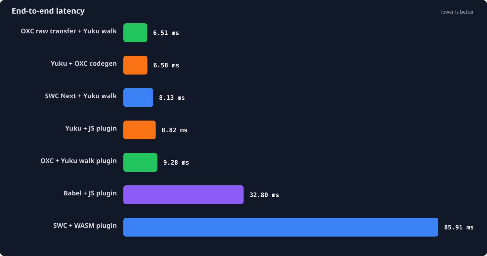
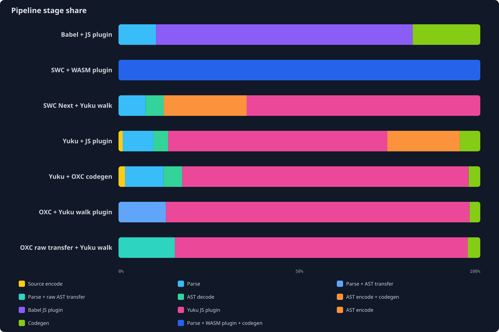
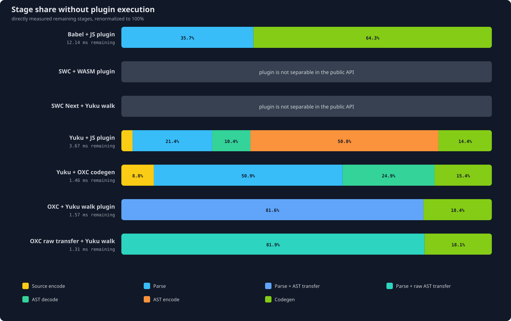

# Transform Plugin Benchmark

Reproducible benchmark of five styled-components transform pipelines:

- `babel-plugin-styled-components` as a Babel JavaScript plugin
- `@swc/plugin-styled-components` as an SWC WASM plugin
- the Babel plugin behavior ported to a Yuku JavaScript plugin
- `oxc-parser` + the Yuku walk plugin + `oxc-codegen`
- the same OXC pipeline with `experimentalRawTransfer`

The workload is a pinned real-world multi-file corpus. Every timed iteration starts with the same
87 source files and ends with generated code for all 87 files.

## Result

Node.js 24.18.1 on the machine documented below. Lower is better.



| Transformer | Median | Independent run medians | Run spread | Relative to Yuku |
|-------------|-------:|-------------------------|-----------:|-----------------:|
| **OXC raw transfer + Yuku walk** | **6.63 ms** | 6.680, 6.626, 6.550 ms | 1.96% | 0.75× |
| Yuku + JS plugin | 8.83 ms | 8.825, 8.973, 8.812 ms | 1.82% | 1.00× |
| OXC + Yuku walk plugin | 9.42 ms | 9.425, 9.450, 9.319 ms | 1.39% | 1.07× |
| Babel + JS plugin | 33.05 ms | 33.437, 32.818, 33.046 ms | 1.88% | 3.74× |
| SWC + WASM plugin | 85.44 ms | 84.898, 86.220, 85.436 ms | 1.55% | 9.68× |

On this corpus, OXC raw transfer reduced the complete OXC pipeline median by 29.7%, from 9.42 ms
to 6.63 ms. This is a full `parse → plugin → codegen` result across 87 modules, not a standalone
walker microbenchmark.

## Real-world workload

The corpus is the production JavaScript under `app/` from
[`react-boilerplate` v4.0.0](https://github.com/react-boilerplate/react-boilerplate/tree/d19099afeff64ecfb09133c06c1cb18c0d40887e),
pinned at commit `d19099afeff64ecfb09133c06c1cb18c0d40887e`. Tests are excluded. The source is
vendored under [`benchmark/fixtures/react-boilerplate`](benchmark/fixtures/react-boilerplate) with
its MIT license.

| Corpus property | Value |
|-----------------|------:|
| Production modules | 87 |
| Source size | 57,051 bytes |
| Source lines | 2,313 |
| Modules importing styled-components | 34 |
| Modules containing JSX | 27 |
| Transformed styled components | 32 |

Files are transformed separately in stable path order. They are not concatenated: per-module API,
parse, codegen, filename, displayName, and component ID costs remain part of the workload.

All pipelines receive the same source and options:

```json
{
  "cssProp": true,
  "displayName": true,
  "fileName": true,
  "meaninglessFileNames": ["index"],
  "minify": true,
  "namespace": "",
  "pure": true,
  "ssr": true,
  "topLevelImportPaths": [],
  "transpileTemplateLiterals": true
}
```

The outputs need not be byte-identical. They must provide the same styled-components feature
coverage: all five pipelines emit 32 `.withConfig` calls, 32 display names, 32 unique component
IDs, and no remaining styled tagged templates. Every output is reparsed before measurement.

SWC's normal `transformSync` path also lowers JSX, so its output contains no JSX; the other four
source-to-source plugin paths preserve it. That extra work is part of the measured SWC public API
pipeline. The benchmark compares concrete integration paths, not an artificially equalized AST
operation count.

**OXC limitation:** `oxc-codegen` does not print comments, so both OXC rows drop PURE annotations.

## Inspectable artifacts

The full inputs are the vendored corpus. A representative styled component and all five generated
forms are committed under [`artifacts/styled-components`](artifacts/styled-components):

- [`input.jsx`](artifacts/styled-components/input.jsx)
- [`babel-output.jsx`](artifacts/styled-components/babel-output.jsx)
- [`swc-output.js`](artifacts/styled-components/swc-output.js)
- [`yuku-output.jsx`](artifacts/styled-components/yuku-output.jsx)
- [`oxc-output.jsx`](artifacts/styled-components/oxc-output.jsx)
- [`oxc-raw-transfer-output.jsx`](artifacts/styled-components/oxc-raw-transfer-output.jsx)
- [`manifest.json`](artifacts/styled-components/manifest.json), containing aggregate corpus/output
  hashes, byte sizes, and validation counts

The regular and raw-transfer OXC outputs are asserted byte-for-byte equal across the complete
corpus.

## Stage breakdown

Stage profiling is a separate instrumented run over the same corpus. Each value is the median of
three independent run means; stage values add up within a pipeline.



| Transformer | Stage | Runtime | Median run mean | Share |
|-------------|-------|---------|----------------:|------:|
| Babel + JS plugin | parse | JS | 4.535 ms | 10.8% |
| Babel + JS plugin | plugin transform | JS | 29.801 ms | 70.9% |
| Babel + JS plugin | codegen | JS | 7.716 ms | 18.3% |
| SWC + WASM plugin | parse + plugin + codegen | native + WASM | 89.347 ms | 100.0% |
| Yuku + JS plugin | source encode | JS | 0.112 ms | 1.2% |
| Yuku + JS plugin | parse | native | 0.832 ms | 8.6% |
| Yuku + JS plugin | AST decode | JS | 0.396 ms | 4.1% |
| Yuku + JS plugin | plugin transform | JS | 5.905 ms | 60.9% |
| Yuku + JS plugin | AST encode | JS | 1.889 ms | 19.5% |
| Yuku + JS plugin | codegen | native | 0.556 ms | 5.7% |
| OXC + Yuku walk plugin | parse + AST transfer | native + JS | 1.249 ms | 12.8% |
| OXC + Yuku walk plugin | plugin transform | JS | 8.209 ms | 84.3% |
| OXC + Yuku walk plugin | codegen | JS | 0.281 ms | 2.9% |
| OXC raw transfer + Yuku walk | parse + raw AST transfer | native + JS | 1.056 ms | 15.3% |
| OXC raw transfer + Yuku walk | plugin transform | JS | 5.629 ms | 81.4% |
| OXC raw transfer + Yuku walk | codegen | JS | 0.228 ms | 3.3% |

SWC exposes the WASM plugin through a complete transform call, not as an independently measurable
AST stage. Its row therefore stays combined. The benchmark does not estimate plugin time by
subtraction.

The OXC parse stages include native parsing and transfer into JavaScript ESTree objects. The raw
pipeline uses `{ experimentalRawTransfer: true }`; its lower plugin-stage time is an observed
property of that complete AST representation and walk, not proof that raw transfer alone speeds up
arbitrary JavaScript code.

### Stages excluding separable plugin execution



| Transformer | Directly measured remainder | Remainder normalized to 100% |
|-------------|----------------------------:|------------------------------|
| Babel + JS plugin | 12.250 ms | parse 37.0%, codegen 63.0% |
| SWC + WASM plugin | not separable | plugin shares the public transform call |
| Yuku + JS plugin | 3.785 ms | encode 3.0%, parse 22.0%, decode 10.5%, AST encode 49.9%, codegen 14.7% |
| OXC + Yuku walk plugin | 1.530 ms | parse + AST transfer 81.6%, codegen 18.4% |
| OXC raw transfer + Yuku walk | 1.285 ms | parse + raw AST transfer 82.2%, codegen 17.8% |

This view removes only the directly measured `plugin transform` stage and renormalizes the
remainder. It is not a separate no-op benchmark.

## Correctness coverage

The Yuku implementation is in
[`scripts/yuku-styled-components-plugin.ts`](scripts/yuku-styled-components-plugin.ts). The test
suite has 70 cases:

- 48 upstream fixtures from `babel-plugin-styled-components@2.3.0`
- 14 additional Babel-to-Yuku parity cases
- 8 corpus, profile, output, and committed-artifact contracts

The benchmark contract validates feature coverage rather than printer formatting. OXC regular and
raw transfer must also generate identical corpus outputs.

## Measurement environment

| Item | Exact value |
|------|-------------|
| Runtime | Node.js 24.18.1 |
| Package manager | npm 11.16.0 |
| CPU | Apple M1 Max |
| Reported CPU cores | 10 |
| Memory | 32 GB |
| OS | Darwin 24.6.0, arm64 |
| Babel | `@babel/core@7.29.7`, plugin `2.3.0` |
| SWC | `@swc/core@1.15.46`, WASM plugin `12.19.0` |
| Yuku | parser, AST, and codegen `0.8.5` |
| OXC | parser and codegen `0.144.0` |

Each transformer runs in a fresh child process for each of three independent runs. A run warms for
1,000 ms and measures for 5,000 ms. Transformer order rotates between runs. The headline value is
the median of the three run medians; “run spread” is `(maximum − minimum) / reported median`.
The median within-run RME remains in the raw JSON but is not presented as a cross-process
confidence interval.

The profile uses the same process isolation, rotation, warmup, duration, and three-run aggregation.
The raw data is committed in [`result/styled-components.json`](result/styled-components.json).

## Reproduce

```bash
fnm install 24.18.1
fnm use 24.18.1
node --version # v24.18.1
npm --version  # 11.16.0

npm ci
npm run reproduce:styled-components
```

The reproduction command rejects another Node version, runs all tests, records three end-to-end
and stage-profile runs, validates the result metadata, and regenerates the artifacts and SVGs.

For development:

```bash
npm run type-check
npm test
npm run artifacts
npm run charts
```

Exploratory runs can override `BENCH_TIME`, `BENCH_WARMUP`, `BENCH_RUNS`, `PROFILE_TIME`, or
`PROFILE_WARMUP`. The exact reproduction command always restores the recorded settings.
