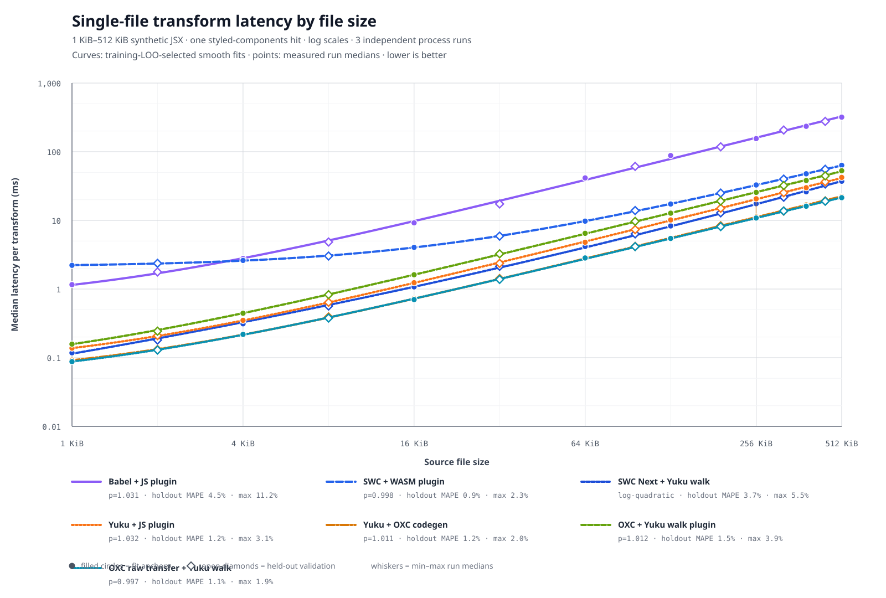

# Transform Plugin Benchmark

Reproducible benchmark of seven styled-components transform pipelines:

- `babel-plugin-styled-components` as a Babel JavaScript plugin
- `@swc/plugin-styled-components` as an SWC WASM plugin
- `@swc-next/core` parse/print with the Yuku JavaScript plugin
- the Babel plugin behavior ported to a Yuku JavaScript plugin
- the same Yuku parser and plugin with `oxc-codegen`
- `oxc-parser` + the Yuku walk plugin + `oxc-codegen`
- the same OXC pipeline with `experimentalRawTransfer`

The workload is a pinned real-world multi-file corpus. Every timed iteration starts with the same
87 source files and ends with generated code for all 87 files.

## SWC Next walker comparison

The comparison keeps SWC Next parse/print, corpus, and plugin options unchanged. Each walker
has its own complete styled-components implementation:

- [`yuku-styled-components-plugin.ts`](scripts/yuku-styled-components-plugin.ts) uses Yuku's
  native visitors and mutation context.
- [`zimmerframe-styled-components-plugin.ts`](scripts/zimmerframe-styled-components-plugin.ts)
  uses Zimmerframe's native `path`, `next`, `visit`, and returned replacement nodes. CSS props
  are handled directly on JSX opening elements, without emulating Yuku's `replace`/`remove`.

Both plugins use the same option defaults, AST builders, CSS/hash algorithms, and phase order:
collect imports/bindings, transform styled nodes, collect scopes/names, then transform CSS props.
Their implementations are intentionally separate; behavior changes must update both files and
pass the common parity fixtures. There is no shared runtime plugin or walker compatibility layer.
Tests verify byte-identical output across 87 corpus files and 67 plugin cases, including PURE
comments through Yuku codegen, nested templates, copied scopes, CSS props, and import insertion.
This compares two native plugin implementations end to end; plugin work remains part of the
measurement, so the result is not a standalone walker speed claim.

Latest measurements on Node 24.18.1 / Apple M5 Max, over the full 87-file corpus:

| Pipeline | End-to-end median | Run spread | Plugin stage |
|---|---:|---:|---:|
| SWC Next + Yuku walk | 5.247 ms | 3.94% | 4.279 ms |
| SWC Next + Zimmerframe | 5.221 ms | 2.24% | 4.242 ms |

End-to-end values are medians of six process medians. Plugin stages are medians of six
separately measured process means. The approximately 0.5% end-to-end difference is smaller
than either variant's observed run spread and does not establish a stable winner.

See [the native-plugin report](result/swc-next-walkers-native.md) and
[raw measurements](result/swc-next-walkers-native.json). The earlier
[adapter report](result/swc-next-walkers.md) and [data](result/swc-next-walkers.json) are historical
and include compatibility-layer overhead. The seven-pipeline results below are also historical.

```bash
fnm use 24.18.1
npm ci
npm run type-check
npm test
npm run bench:walkers
```

This runs only the two SWC Next variants, with six fresh processes per variant, alternating
order, 3 seconds of warmup and 10 seconds of measurement. Stage profiles run separately with
1 second of warmup and 5 seconds of measurement. It writes `result/swc-next-walkers-native.json`, preserving the earlier adapter measurements.

## Result

Node.js 24.18.1 on the machine documented below. Lower is better.


| Transformer | Median | Independent run medians | Run spread | Relative to Yuku |
|-------------|-------:|-------------------------|-----------:|-----------------:|
| **OXC raw transfer + Yuku walk** | **6.51 ms** | 6.506, 6.506, 6.509 ms | 0.05% | 0.74× |
| Yuku + OXC codegen | 6.58 ms | 6.575, 6.644, 6.532 ms | 1.70% | 0.75× |
| SWC Next + Yuku walk | 8.13 ms | 8.133, 8.068, 8.158 ms | 1.11% | 0.92× |
| Yuku + JS plugin | 8.82 ms | 8.834, 8.821, 8.813 ms | 0.24% | 1.00× |
| OXC + Yuku walk plugin | 9.28 ms | 9.277, 9.220, 9.298 ms | 0.85% | 1.05× |
| Babel + JS plugin | 32.80 ms | 32.804, 32.927, 32.412 ms | 1.57% | 3.72× |
| SWC + WASM plugin | 85.91 ms | 85.941, 85.754, 85.912 ms | 0.22% | 9.74× |

Replacing Yuku's AST encode and native codegen path with `oxc-codegen` reduced the complete Yuku
pipeline median by 25.4%, from 8.82 ms to 6.58 ms. OXC raw transfer reduced the complete OXC
pipeline median by 29.9%, from 9.28 ms to 6.51 ms. These are full `parse → plugin → codegen`
results across 87 modules, not standalone walker or codegen microbenchmarks.

## Single-file scaling

The scaling benchmark measures one complete transform call as an exact-size synthetic JSX module
grows from 1 KiB to 512 KiB. Every file contains exactly one styled-components transform target;
the growing portion has stable ordinary JavaScript AST density. This isolates file-size scaling
from the separate effect of increasing the number of plugin matches.



For each curve, training-set leave-one-out error selects between an offset-power model and a
log-quadratic model; six results selected `T = a + b × KiB^p`, while SWC Next selected the
log-quadratic model. Seven intermediate sizes are
held out of fitting and measured independently. A fit is accepted only when held-out MAPE is at
most 6% and the worst held-out point error is at most 15%; all seven fits pass.

| Transformer | 1 KiB | 512 KiB | Fit model | Exponent `p` | Held-out MAPE | Worst held-out error |
|-------------|------:|------:|-----------|-------------:|--------------:|---------------------:|
| Babel + JS plugin | 1.159 ms | 318.82 ms | offset-power | 1.031 | 4.51% | 11.22% |
| SWC + WASM plugin | 2.216 ms | 63.41 ms | offset-power | 0.998 | 0.93% | 2.29% |
| SWC Next + Yuku walk | 0.118 ms | 37.18 ms | log-quadratic | — | 3.74% | 5.46% |
| Yuku + JS plugin | 0.138 ms | 42.25 ms | offset-power | 1.032 | 1.24% | 3.08% |
| Yuku + OXC codegen | 0.092 ms | 22.19 ms | offset-power | 1.011 | 1.25% | 2.01% |
| OXC + Yuku walk plugin | 0.158 ms | 52.82 ms | offset-power | 1.012 | 1.49% | 3.94% |
| OXC raw transfer + Yuku walk | 0.088 ms | 21.40 ms | offset-power | 0.997 | 1.15% | 1.87% |

The reported value at each size is the median of three independent process-run medians. Each
process warms the transformer on a 16 KiB module, then measures each size for at least 200 ms;
every size also runs at least three complete transforms per process. The chart uses log scales,
shows the actual measurements, and draws min–max whiskers for the three run medians. The fitted
functions describe this controlled workload only and are not extrapolated past 512 KiB.

## Real-world workload

The corpus is the production JavaScript under `app/` from
[`react-boilerplate` v4.0.0](https://github.com/react-boilerplate/react-boilerplate/tree/d19099afeff64ecfb09133c06c1cb18c0d40887e),
pinned at commit `d19099afeff64ecfb09133c06c1cb18c0d40887e`. Tests are excluded. The source is
vendored under [`benchmark/fixtures/react-boilerplate`](benchmark/fixtures/react-boilerplate) with
its MIT license.

| Corpus property | Value |
|-----------------|------:|
| Production modules | 87 |
| Source size | 57,051 bytes |
| Source lines | 2,313 |
| Modules importing styled-components | 34 |
| Modules containing JSX | 27 |
| Transformed styled components | 32 |

Files are transformed separately in stable path order. They are not concatenated: per-module API,
parse, codegen, filename, displayName, and component ID costs remain part of the workload.

All pipelines receive the same source and options:

```json
{
  "cssProp": true,
  "displayName": true,
  "fileName": true,
  "meaninglessFileNames": ["index"],
  "minify": true,
  "namespace": "",
  "pure": true,
  "ssr": true,
  "topLevelImportPaths": [],
  "transpileTemplateLiterals": true
}
```

The outputs need not be byte-identical. They must provide the same styled-components feature
coverage: all seven pipelines emit 32 `.withConfig` calls, 32 display names, 32 unique component
IDs, preserve 137 JSX elements, and leave no styled tagged templates. Every output is reparsed
before measurement. JSX lowering is outside the measured transform endpoint.

**OXC limitation:** `oxc-codegen` does not print comments; its three rows drop PURE annotations.

## Inspectable artifacts

The full inputs are the vendored corpus. A representative styled component and all seven generated
forms are committed under [`artifacts/styled-components`](artifacts/styled-components):

- [`input.jsx`](artifacts/styled-components/input.jsx)
- [`babel-output.jsx`](artifacts/styled-components/babel-output.jsx)
- [`swc-output.jsx`](artifacts/styled-components/swc-output.jsx)
- [`swc-next-output.jsx`](artifacts/styled-components/swc-next-output.jsx)
- [`yuku-output.jsx`](artifacts/styled-components/yuku-output.jsx)
- [`yuku-oxc-codegen-output.jsx`](artifacts/styled-components/yuku-oxc-codegen-output.jsx)
- [`oxc-output.jsx`](artifacts/styled-components/oxc-output.jsx)
- [`oxc-raw-transfer-output.jsx`](artifacts/styled-components/oxc-raw-transfer-output.jsx)
- [`manifest.json`](artifacts/styled-components/manifest.json), containing aggregate corpus/output
  hashes, byte sizes, and validation counts

The Yuku-parser, regular OXC, and raw-transfer OXC outputs printed by `oxc-codegen` are asserted
byte-for-byte equal across the complete corpus.

## Stage breakdown

Stage profiling is a separate instrumented run over the same corpus. Each value is the median of
three independent run means; stage values add up within a pipeline.


| Transformer | Stage | Runtime | Median run mean | Share |
|-------------|-------|---------|----------------:|------:|
| Babel + JS plugin | parse | JS | 4.328 ms | 10.4% |
| Babel + JS plugin | plugin transform | JS | 29.645 ms | 71.0% |
| Babel + JS plugin | codegen | JS | 7.808 ms | 18.7% |
| SWC + WASM plugin | parse + plugin + codegen | native + WASM | 90.597 ms | 100.0% |
| SWC Next + Yuku walk | parse | native | 0.650 ms | 7.5% |
| SWC Next + Yuku walk | AST decode | JS | 0.428 ms | 5.0% |
| SWC Next + Yuku walk | plugin transform | JS | 5.569 ms | 64.6% |
| SWC Next + Yuku walk | AST encode + codegen | JS + native | 1.979 ms | 22.9% |
| Yuku + JS plugin | source encode | JS | 0.111 ms | 1.2% |
| Yuku + JS plugin | parse | native | 0.786 ms | 8.5% |
| Yuku + JS plugin | AST decode | JS | 0.380 ms | 4.1% |
| Yuku + JS plugin | plugin transform | JS | 5.636 ms | 60.6% |
| Yuku + JS plugin | AST encode | JS | 1.862 ms | 20.0% |
| Yuku + JS plugin | codegen | native | 0.528 ms | 5.7% |
| Yuku + OXC codegen | source encode | JS | 0.128 ms | 1.8% |
| Yuku + OXC codegen | parse | native | 0.745 ms | 10.6% |
| Yuku + OXC codegen | AST decode | JS | 0.364 ms | 5.2% |
| Yuku + OXC codegen | plugin transform | JS | 5.558 ms | 79.2% |
| Yuku + OXC codegen | codegen | JS | 0.226 ms | 3.2% |
| OXC + Yuku walk plugin | parse + AST transfer | native + JS | 1.278 ms | 13.1% |
| OXC + Yuku walk plugin | plugin transform | JS | 8.170 ms | 83.9% |
| OXC + Yuku walk plugin | codegen | JS | 0.289 ms | 3.0% |
| OXC raw transfer + Yuku walk | parse + raw AST transfer | native + JS | 1.072 ms | 15.6% |
| OXC raw transfer + Yuku walk | plugin transform | JS | 5.568 ms | 81.0% |
| OXC raw transfer + Yuku walk | codegen | JS | 0.238 ms | 3.5% |

SWC exposes the WASM plugin through a complete transform call, not as an independently measurable
AST stage. Its row therefore stays combined. The benchmark does not estimate plugin time by
subtraction.

The OXC parse stages include native parsing and transfer into JavaScript ESTree objects. The raw
pipeline uses `{ experimentalRawTransfer: true }`; its lower plugin-stage time is an observed
property of that complete AST representation and walk, not proof that raw transfer alone speeds up
arbitrary JavaScript code.

### Stages excluding separable plugin execution


| Transformer | Directly measured remainder | Remainder normalized to 100% |
|-------------|----------------------------:|------------------------------|
| Babel + JS plugin | 12.136 ms | parse 35.7%, codegen 64.3% |
| SWC + WASM plugin | not separable | plugin shares the public transform call |
| SWC Next + Yuku walk | 2.407 ms | decode 17.8%, AST encode + codegen 82.2% |
| Yuku + JS plugin | 3.667 ms | encode 3.0%, parse 21.4%, decode 10.4%, AST encode 50.8%, codegen 14.4% |
| Yuku + OXC codegen | 1.464 ms | encode 8.8%, parse 50.9%, decode 24.9%, codegen 15.4% |
| OXC + Yuku walk plugin | 1.567 ms | parse + AST transfer 81.6%, codegen 18.4% |
| OXC raw transfer + Yuku walk | 1.310 ms | parse + raw AST transfer 81.8%, codegen 18.2% |

This view removes only the directly measured `plugin transform` stage and renormalizes the
remainder. It is not a separate no-op benchmark.

## Correctness coverage

The Yuku implementation is in
[`scripts/yuku-styled-components-plugin.ts`](scripts/yuku-styled-components-plugin.ts). The test
suite has 75 cases:

- 48 upstream fixtures from `babel-plugin-styled-components@2.3.0`
- 14 additional Babel-to-Yuku parity cases
- 10 corpus, profile, output, and committed-artifact contracts

The benchmark contract validates feature coverage rather than printer formatting. All three
`oxc-codegen` pipelines must also generate identical corpus outputs.

## Measurement environment

| Item | Exact value |
|------|-------------|
| Runtime | Node.js 24.18.1 |
| Package manager | npm 11.16.0 |
| CPU | Apple M1 Max |
| Reported CPU cores | 10 |
| Memory | 32 GB |
| OS | Darwin 24.6.0, arm64 |
| Babel | `@babel/core@7.29.7`, plugin `2.3.0` |
| SWC | `@swc/core@1.15.46`, WASM plugin `12.19.0` |
| SWC Next | `@swc-next/core@0.2.1` |
| Yuku | parser, AST, and codegen `0.8.5` |
| OXC | parser and codegen `0.144.0` |

Each transformer runs in a fresh child process for each of three independent runs. A run warms for
1,000 ms and measures for 5,000 ms. Transformer order rotates between runs. The headline value is
the median of the three run medians; “run spread” is `(maximum − minimum) / reported median`.
The median within-run RME remains in the raw JSON but is not presented as a cross-process
confidence interval.

The profile uses the same process isolation, rotation, warmup, duration, and three-run aggregation.
The raw data is committed in [`result/styled-components.json`](result/styled-components.json).

## Reproduce

```bash
fnm install 24.18.1
fnm use 24.18.1
node --version # v24.18.1
npm --version  # 11.16.0

npm ci
npm run reproduce:styled-components
```

The reproduction command rejects another Node version, runs all tests, records three end-to-end
and stage-profile runs, validates the result metadata, and regenerates the artifacts and SVGs.

For development:

```bash
npm run type-check
npm test
npm run artifacts
npm run bench:scaling
npm run charts
```

Exploratory runs can override `BENCH_TIME`, `BENCH_WARMUP`, `BENCH_RUNS`, `PROFILE_TIME`, or
`PROFILE_WARMUP`. The exact reproduction command always restores the recorded settings.
