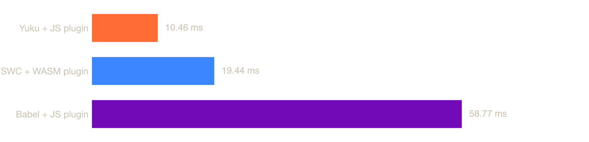
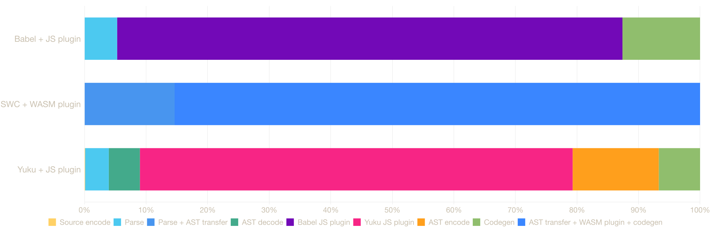

# Transform Plugin Benchmark

Reproducible end-to-end and stage-level benchmarks for JavaScript transform plugin systems.

The first case compares:

- `babel-plugin-styled-components`, running as a Babel JavaScript plugin
- `@swc/plugin-styled-components`, running as an SWC WASM plugin
- a fixture-scoped styled-components JavaScript plugin running on Yuku's decoded ESTree

## Styled-components case

The input contains 240 styled components and 483 tagged templates across 0.12 MB of generated
source. It exercises `styled.tag`, `styled(Component)`, `.attrs()`, nested `css`, `keyframes`,
`createGlobalStyle`, interpolations, CSS minification, display names, component IDs, PURE
annotations, and template lowering.

Every timed iteration performs the complete public pipeline from source text to generated code.
Every implementation's output is reparsed and validated before measurement.

### Bun 1.3.5 results

Measured on macOS 24.6.0, Apple M1 Max, 10 cores, and 32 GB RAM. Each of 3 independent runs
warms up for 1,000 ms and measures for 5,000 ms.



| Transformer | Median | Independent run medians | Relative |
|-------------|-------:|-------------------------|---------:|
| **Yuku + JS plugin** | **10.46 ms** | 10.367, 10.473, 10.463 ms | **baseline** |
| SWC + WASM plugin | 19.44 ms | 19.109, 19.437, 19.764 ms | 1.86× slower |
| Babel + JS plugin | 58.77 ms | 57.486, 58.766, 61.037 ms | 5.62× slower |

### Stage breakdown

Stage means are used because they are additive. The stages for one implementation sum to its
profiled pipeline mean. The end-to-end median above remains the cross-tool comparison.



| Transformer | Stage | Runtime | Mean | Share |
|-------------|-------|---------|-----:|------:|
| Babel + JS plugin | parse | JS | 3.55 ms | 5.3% |
| Babel + JS plugin | plugin transform | JS | 55.13 ms | 82.1% |
| Babel + JS plugin | codegen | JS | 8.47 ms | 12.6% |
| SWC + WASM plugin | parse + AST transfer | native + JS | 6.82 ms | 14.6% |
| SWC + WASM plugin | AST transfer + plugin + codegen | JS + WASM + native | 39.75 ms | 85.4% |
| Yuku + JS plugin | source encode | JS | 0.01 ms | 0.1% |
| Yuku + JS plugin | parse | native | 0.42 ms | 3.8% |
| Yuku + JS plugin | AST decode | JS | 0.55 ms | 5.1% |
| Yuku + JS plugin | plugin transform | JS | 7.63 ms | 70.3% |
| Yuku + JS plugin | AST encode | JS | 1.52 ms | 14.0% |
| Yuku + JS plugin | codegen | native | 0.73 ms | 6.7% |

SWC's WASM plugin API returns generated code instead of a transformed AST. Consequently, AST
transfer, the WASM plugin, and native codegen remain one directly measured stage. Splitting them
by subtraction would not be a direct measurement.

### Yuku plugin scope

The Yuku plugin lives in
[`scripts/yuku-styled-components-plugin.ts`](scripts/yuku-styled-components-plugin.ts).

It is a fixture-scoped implementation of the core operations exercised by this case, not a full
port of `babel-plugin-styled-components`. It does not claim parity for the `css` prop, CommonJS
detection, namespaces, top-level import path configuration, or Babel's exact filename and hashing
behavior. The benchmark compares the three pipelines under the validated fixture contract, not
full plugin feature parity.

## Exact reproduction

The immutable `styled-components-v1` tag fixes the source revision. The lockfile fixes the full
dependency graph. The reproduction script rejects a mismatched runtime and overrides all
measurement settings with the recorded values.

### Canonical Bun run

```bash
git clone https://github.com/SoonIter/transform-plugin-benchmark.git
cd transform-plugin-benchmark
git checkout styled-components-v1
bun --version # must print 1.3.5
bun install --frozen-lockfile
bun run reproduce:styled-components
```

This writes `result/styled-components.json` and regenerates both charts. Compare the new raw
result with the checked-in measurement using:

```bash
git diff -- result/styled-components.json charts/
```

Absolute latency depends on CPU, operating-system load, power mode, and thermal state.
Reproduction fixes the source, dependencies, runtime, fixture, options, warmup, measurement
duration, process isolation, run count, validation, and aggregation.

### Node run

The same harness also runs on Node. Node is a separate runtime measurement because JavaScript
execution is part of these pipelines, so it writes a separate result file.

```bash
node --version # must print v26.7.0
node --import tsx scripts/reproduce-styled-components.ts
# writes result/styled-components-node.json
```

The checked-in Node result is [`result/styled-components-node.json`](result/styled-components-node.json).

## Development

```bash
bun install --frozen-lockfile
bun run type-check
bun test
```

Custom, non-canonical measurements can be configured with `BENCH_TIME`, `BENCH_WARMUP`,
`BENCH_RUNS`, `PROFILE_TIME`, `PROFILE_WARMUP`, and `STYLED_COMPONENTS_COUNT` when invoking
`bun run bench:styled-components` or `bun run bench:styled-components:node`.
